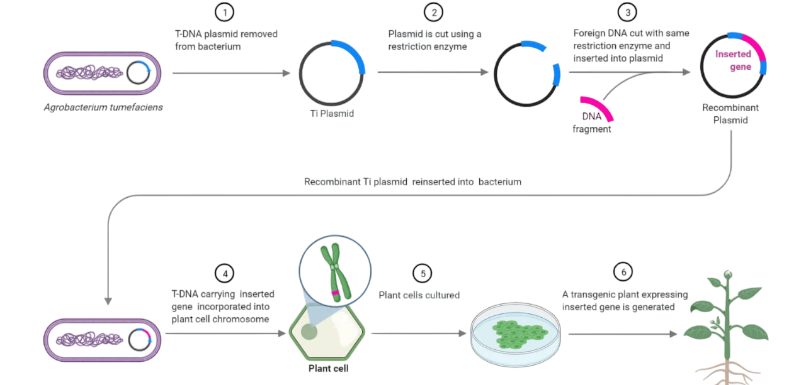

## Procedure

### Media Preparation for Agrobacterium-Mediated Gene Transfer

1. **LB Medium – For Growing Agrobacterium**
This medium helps grow the Agrobacterium bacteria.
**Ingredients for 1 liter:**
- 5 grams yeast extract (for nutrients)
- 10 grams tryptone (a protein source)
- 5 grams sodium chloride (common salt)
- Mix everything in **1 liter of distilled water**
**Before use (for 50 ml):**
- Add **50 µl of rifampicin** (100 mg/ml stock)
- Add **50 µl of kanamycin** (50 mg/ml stock)
These antibiotics help select the right strain of Agrobacterium.

2. **MS Medium – For Seed Germination**
This medium is used to grow seeds into small plants.
**Ingredients for 1 liter:**
- 4.43 grams MS powder (contains nutrients for plant growth)
- 3 grams sucrose (sugar for energy)
- Mix in 1 liter of distilled water
- Add **2.5 grams of gellan gum** (to make it gel)
- Sterilize the medium by autoclaving (heating under pressure)
- Pour **25 ml per Petri plate** inside a clean laminar flow hood

3. **Cocultivation Medium – For Infection with Agrobacterium**
This medium helps plants absorb the gene from Agrobacterium.
**Start with MS medium and then add:**
- **750 µl of BAP** (2 mg/ml) – helps promote cell division
- **500 µl of ABA** (2 mg/ml) – helps in stress responses
Pour **25 ml per Petri plate** under sterile conditions.

4. **Shooting Medium – For Shoot Formation**
This medium helps the plant start growing new shoots (small stems/leaves).
**Start with cocultivation medium, then add:**
- **50 µl of kanamycin** (50 mg/ml) – selects transformed cells
- **2.5 ml of carbenicillin** (200 mg/ml) – kills leftover Agrobacterium

5. Rooting Medium – For Root Development
This medium supports root growth in the shoots.
**Start with MS medium, then add:**
- **50 µl of kanamycin** (50 mg/ml)
- **1 ml of carbenicillin** (200 mg/ml)

### Agrobacterium-Mediated Gene Transfer Procedure

**Step 1: Sterilize and Germinate the Seeds**
- Clean the seeds by exposing them to chlorine gas for 1–2 hours.
- Soak the seeds in water for 2 hours at room temperature.
- Peel off the seed coat using forceps.
- Dip the seeds quickly (for 30 seconds) in 75% alcohol to kill germs.
- Rinse with a 3% sodium hypochlorite solution to make sure they're fully sterilized.
- Place the clean seeds on a growth medium in Petri dishes.
- Keep them in the dark at 28°C for 2 days so they can sprout.

**Step 2: Prepare Agrobacterium (the Gene Carrier)**
- Take 2 ml of LB medium (a nutrient-rich liquid) and add antibiotics like rifampicin and kanamycin.
- Add a small amount of Agrobacterium to this medium and grow it in a shaker at 28°C.
- After it's grown, spin the liquid in a centrifuge to collect the bacteria.
- Remove the liquid and wash the bacteria with MS medium (a plant-friendly liquid).

**Step 3: Prepare the Explants (Cotyledons)**
- Take out the germinated seeds and put them on a clean Petri dish.
- Cut off the root (radicle) and split the seed to get the two cotyledons (seed leaves).
- Clean the cotyledons and place them into a sterile beaker with MS medium.
- Mix these cotyledons gently with the Agrobacterium culture.
- Cover the beaker and place it in a vacuum chamber for a few minutes to help bacteria enter the plant tissue.
- After vacuum treatment, place the infected cotyledons on a filter paper laid over a special cocultivation medium, with the flat side facing up.
- Seal the Petri dishes and keep them in the dark at 28°C for 2 days to let the bacteria transfer the gene.

**Step 4: Start Shoot Growth**
- Move the cotyledons to a new medium that encourages shoot growth and contains antibiotics (kanamycin to select transformed cells and carbenicillin to kill remaining bacteria).
- Keep them under light at 25°C for 2–3 weeks.

**Step 5: Regenerate the Shoots**
- Once small shoots appear, gently remove them and place them on clean filter paper.
- Use a sterile scalpel to cut off the shoot tips and remove the embryoid (non-useful) part.
- Transfer the healthy shoot pieces into small glass jars or culture vessels with a rooting medium.
- Keep them under light at 25°C for 1–2 weeks.
- If roots don’t form, trim the leaves and ends of the shoots and put them in a fresh rooting medium.

**Step 6: Move to Soil (Acclimation)**
- Once roots form, loosen the lid of the culture vessels and keep them at 25°C for 3 more days.
- Take out the plantlets, wash off the gel-like medium under running water.
- Transfer them into pots with moist compost and cover with plastic bags to keep humidity high.
- Keep the pots in a growth chamber with light at 25°C for 1–2 weeks.
- When the plants are strong and healthy, remove the plastic bags and start watering normally.

