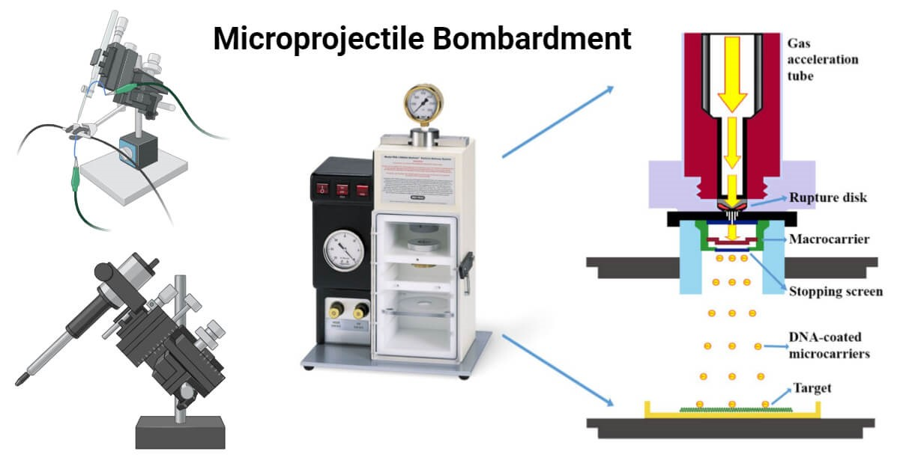
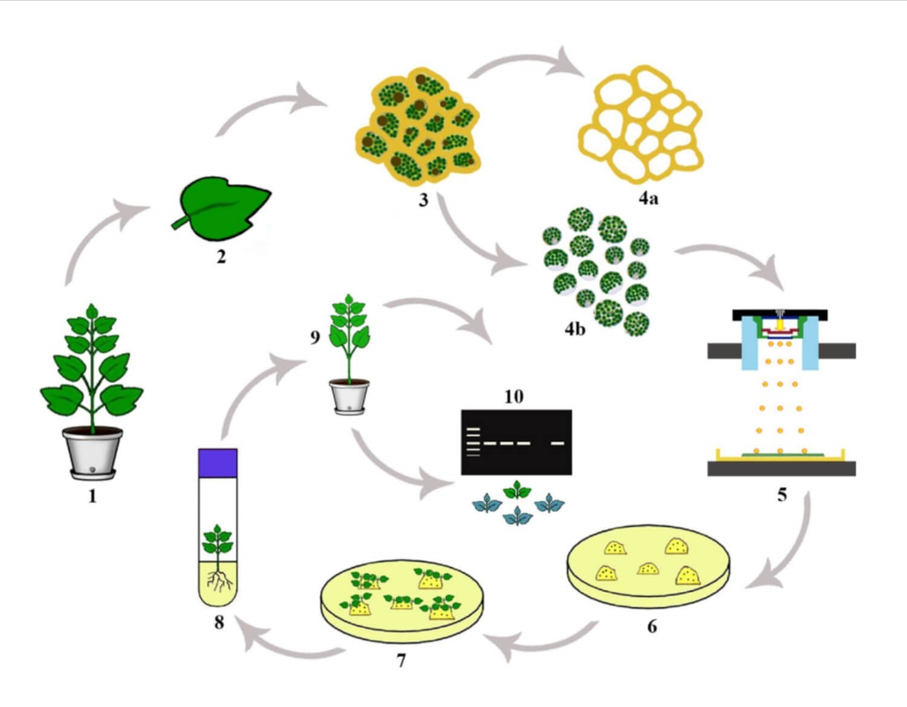

## Theory

There are both direct and indirect methods for altering plant genes. Direct genetic transformation involves using external forces to introduce target genes into plant cells, such as particle bombardment (gene gun). Indirect genetic transformation employs living organisms as carriers, like Agrobacterium for gene transfer.
Microprojectile bombardment is a physical method of gene transfer where high-velocity particles deliver foreign genetic material directly into cells or tissues. This method is also known as Particle Bombardment, Gene Gun, Ballistics, or Particle Acceleration. It was pioneered by John Sanford and Ed Wolf, initially for plant cells, and later adapted for human cells.

Figure 1. Microprojectile Bombardment

#### Principle of Microprojectile Bombardment:
Microprojectile bombardment works by propelling microcarrier particles at high speeds into target cells, allowing the direct transfer of genetic material. The genetic material is attached to microcarrier particles, typically made of gold or tungsten, which are accelerated by an electric discharge or helium pulse. These particles penetrate the cell membrane, entering the cytoplasm, where they release the genetic material, allowing gene expression within the target cells.

#### Microprojectile Bombardment Instruments 
Various gene guns have been developed for microprojectile bombardment:
- Early devices used gunpowder to propel the microcarriers.
- Modern systems utilize high-pressure helium for more efficient particle acceleration.
- Improved gene guns now use pneumatic, electrostatic, and compressed gas forces.
- Common models include the PDS-1000/He, which uses helium gas to accelerate genetic material-coated particles, and the hand-held Helios gene gun, which targets larger tissues. 
Both systems rely on pressurized helium to drive microcarrier particles.

#### Applications of Microprojectile Bombardment
- A widely used method for introducing foreign genes into plant cells, creating genetically modified plants with traits such as disease resistance and enhanced yield.
- Facilitates research into gene function and expression across tissues.
- Useful for studying cell signaling by introducing fluorescent dyes into cells and tissues.

Figure 2. Schematic representation of particle bombardment: Plant transformation via particle bombardment (1) mother plant (2) leaf (3) isolated leaf cells (4a) removed cell walls (4b) protoplasts (5) gene transfer using particle bombardment device (6) callus induction (7) regeneration (8) rooting (9) a young plantlet (10) molecular and histo-chemical analyses 

#### Advantages of Microprojectile Bombardment
- Enables rapid and efficient gene transfer, including the delivery of large nucleic acid fragments.
- Applicable to a wide range of species and cell types.
- Safer than methods that use viruses or chemicals for gene delivery.
- Can penetrate cell walls without the need for protoplasts, making it easier to modify various cell types.

#### Disadvantages of Microprojectile Bombardment
- Requires specialized equipment, making it initially costly.
- High-speed particles can damage target cells, reducing cell viability.
- Less effective for large-scale applications, with the risk of random integration of DNA into the host genome, leading to unpredictable gene expression patterns.

